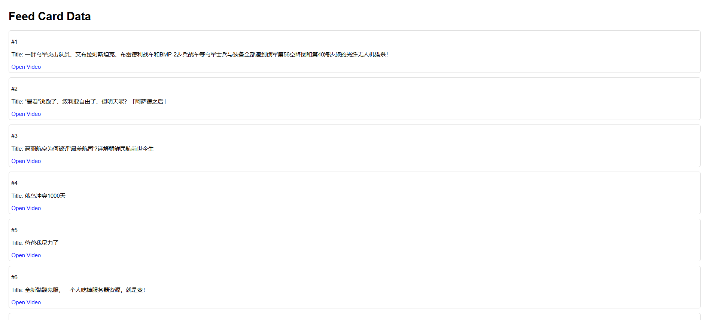

# BiliFeedRecoder
A simple Chrome/Edge extension for recording BiliBili feed

用于记录Bilibili网页版首页推荐的视频的Chrome/Edge插件

## 使用场景

当你在B站首页刷到一个你很喜欢的视频,但一不小心把这个推荐刷新掉了,找不到了,怎么办?
使用BiliFeedRecoder,记录B站每一次推荐给你的视频,让你不再与你爱的视频擦肩而过

## 功能展示

## 使用方式
1. 从Github上下载压缩包
2. 在Chrome/Edge插件管理界面打开开发者模式
3. 加载解压后的压缩包即可使用

## 其他
- 联合作者:ChatGPT  [ChatGPT对话](https://chatgpt.com/share/675fe5e5-d050-800d-a471-0622c287b7e0)

- 有BUG请自行修复,本人技术力有限

